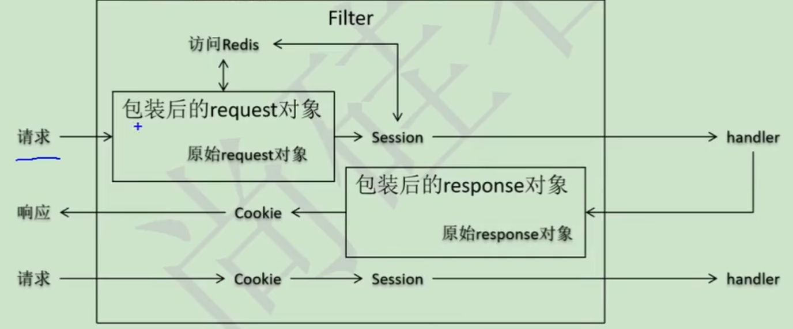

## 项目介绍

> 该项目为尚筹网项目的前台会员系统

简介：尚筹网项目是一个众筹平台，主要作用是帮助创业者发布创业项目，向大众募集启动资金的融资平台，整个项目分为**前台会员**(微服务)和**后台管理**(SSM)两个模块

学习资料：https://www.bilibili.com/video/BV1bE411T7oZ

后台项目地址：

技术点：	

- 前台项目使用 SpringCloud + SpringBoot 的分布式架构; 后台项目使用 SSM 的单一架构
- [后台项目] 中使用 **SpringSecurity** 并基于 RBAC0 的模型完成通过**权限/角色控制用户操作**
- [后台项目] 中使用 **XML加配置 AOP 的方式** 实现 **声明式事务**
- [第三方接口] 通过 **阿里云云市场** 配置项目短信服务

### 架构


## 前端

## 后端

### 实体类进一步细分

1. VO 视图对象
   - 接收游览器发送的对象
   - 把数据响应回给游览器去显示
2. PO 持久化对象
   - 将数据封装到 PO 对象并存入数据库
   - 将数据库查询i出来的数据封装到 PO 对象
3. DO 数据对象
   - 从 各种中间件/第三方接口 中查询出来的数据，例如：Redis / ElasticSearch ...
4. DTO 数据传输对象
   - 微服务之间通信时使用的数据对象

### SpringBoot 整合 Redis

1. 导入依赖

   ```xml
   <dependency>
       <groupId>org.springframework.boot</groupId>
       <artifactId>spring-boot-starter-data-redis</artifactId>
   </dependency>
   <dependency>
       <groupId>org.apache.commons</groupId>
       <artifactId>commons-pool2</artifactId>
   </dependency>
   <dependency>
       <groupId>com.fasterxml.jackson.core</groupId>
       <artifactId>jackson-databind</artifactId>
   </dependency>
   ```

2. 编写配置文件

   ```yaml
   spring:
     redis:
       host: 192.168.227.30
       port: 6379
       timeout: 10000
       lettuce:
         pool:
           max-active: 8
           max-wait: -1
           max-idle: 8
           min-idle: 0
   ```

3. 编写配置类

   ```java
   @Configuration
   public class RedisConfig {
   
       @Resource
       private RedisConnectionFactory redisConnectionFactory;
   
       /**
        * 配置Jackson2JsonRedisSerializer序列化策略
        */
       private Jackson2JsonRedisSerializer<Object> serializer() {
           // 使用Jackson2JsonRedisSerializer来序列化和反序列化redis的value值
           Jackson2JsonRedisSerializer<Object> jackson2JsonRedisSerializer = new Jackson2JsonRedisSerializer<>(Object.class);
           ObjectMapper objectMapper = new ObjectMapper();
   
           // 指定要序列化的域，field,get和set,以及修饰符范围，ANY是都有包括private和public
           objectMapper.setVisibility(PropertyAccessor.ALL, JsonAutoDetect.Visibility.ANY);
   
           objectMapper.enableDefaultTyping(ObjectMapper.DefaultTyping.NON_FINAL);
   
           // 指定序列化输入的类型，类必须是非final修饰的，final修饰的类，比如String,Integer等会跑出异常
           objectMapper.activateDefaultTyping(LaissezFaireSubTypeValidator.instance, ObjectMapper.DefaultTyping.NON_FINAL);
   
           jackson2JsonRedisSerializer.setObjectMapper(objectMapper);
           return jackson2JsonRedisSerializer;
       }
   
   
       @Bean
       public RedisTemplate<String, Object> redisTemplate() {
           RedisTemplate<String, Object> redisTemplate = new RedisTemplate<>();
           redisTemplate.setConnectionFactory(redisConnectionFactory);
           // 用Jackson2JsonRedisSerializer来序列化和反序列化redis的value值
           redisTemplate.setValueSerializer(serializer());
   
           StringRedisSerializer stringRedisSerializer = new StringRedisSerializer();
           // 使用StringRedisSerializer来序列化和反序列化redis的key值
           redisTemplate.setKeySerializer(stringRedisSerializer);
   
           // hash的key也采用String的序列化方式
           redisTemplate.setHashKeySerializer(stringRedisSerializer);
           // hash的value序列化方式采用jackson
           redisTemplate.setHashValueSerializer(serializer());
           redisTemplate.afterPropertiesSet();
           return redisTemplate;
       }
   
       @Bean
       public CacheManager cacheManager() {
           RedisSerializer<String> redisSerializer = new StringRedisSerializer();
           // 配置序列化（解决乱码的问题）
           RedisCacheConfiguration config = RedisCacheConfiguration.defaultCacheConfig()
               // 缓存有效期
               //.entryTtl(timeToLive)
               // 使用StringRedisSerializer来序列化和反序列化redis的key值
               .serializeKeysWith(RedisSerializationContext.SerializationPair.fromSerializer(redisSerializer))
               // 使用Jackson2JsonRedisSerializer来序列化和反序列化redis的value值
               .serializeValuesWith(RedisSerializationContext.SerializationPair.fromSerializer(serializer()))
               // 禁用空值
               .disableCachingNullValues();
   
           return RedisCacheManager.builder(redisConnectionFactory)
               .cacheDefaults(config)
               .build();
       }
   
       @Bean
       public IGlobalCache globalCache() {
           return new CrowdRedisCacheManager(redisTemplate());
       }
   
   }
   ```

4. 编写工具类

   ```java
   public interface IGlobalCache {
   
       /**
        * 指定缓存失效时间
        *
        * @param key  键
        * @param time 时间(秒)
        * @return
        */
       boolean expire(String key, long time);
   
       /**
        * @param key 键 不能为null
        * @return 时间(秒) 返回0代表为永久有效
        */
       long getExpire(String key);
   
       /**
        * 判断key是否存在
        *
        * @param key 键
        * @return true 存在 false不存在
        */
       boolean hasKey(String key);
   
       /**
        * 删除缓存
        *
        * @param key 可以传一个值 或多个
        */
       void del(String... key);
       // ============================String=============================
   
       /**
        * 普通缓存获取
        *
        * @param key 键
        * @return 值
        */
       Object get(String key);
   
       /**
        * 普通缓存放入
        *
        * @param key   键
        * @param value 值
        * @return true成功 false失败
        */
       boolean set(String key, Object value);
   
       /**
        * 普通缓存放入并设置时间
        *
        * @param key   键
        * @param value 值
        * @param time  时间(秒) time要大于0 如果time小于等于0 将设置无限期
        * @return true成功 false 失败
        */
       boolean set(String key, Object value, long time);
   
       /**
        * 递增
        *
        * @param key   键
        * @param delta 要增加几(大于0)
        * @return
        */
       long incr(String key, long delta);
   
       /**
        * 递减
        *
        * @param key   键
        * @param delta 要减少几(小于0)
        * @return
        */
       long decr(String key, long delta);
   
       /**
        * HashGet
        *
        * @param key  键 不能为null
        * @param item 项 不能为null
        * @return 值
        */
       Object hget(String key, String item);
   
       /**
        * 获取hashKey对应的所有键值
        *
        * @param key 键
        * @return 对应的多个键值
        */
       Map<Object, Object> hmget(String key);
   
       /**
        * HashSet
        *
        * @param key 键
        * @param map 对应多个键值
        * @return true 成功 false 失败
        */
       boolean hmset(String key, Map<String, Object> map);
   
       /**
        * HashSet 并设置时间
        *
        * @param key  键
        * @param map  对应多个键值
        * @param time 时间(秒)
        * @return true成功 false失败
        */
       boolean hmset(String key, Map<String, Object> map, long time);
   
       /**
        * 向一张hash表中放入数据,如果不存在将创建
        *
        * @param key   键
        * @param item  项
        * @param value 值
        * @return true 成功 false失败
        */
       boolean hset(String key, String item, Object value);
   
       /**
        * 向一张hash表中放入数据,如果不存在将创建
        *
        * @param key   键
        * @param item  项
        * @param value 值
        * @param time  时间(秒) 注意:如果已存在的hash表有时间,这里将会替换原有的时间
        * @return true 成功 false失败
        */
       boolean hset(String key, String item, Object value, long time);
   
       /**
        * 删除hash表中的值
        *
        * @param key  键 不能为null
        * @param item 项 可以使多个 不能为null
        */
       void hdel(String key, Object... item);
   
       /**
        * 判断hash表中是否有该项的值
        *
        * @param key  键 不能为null
        * @param item 项 不能为null
        * @return true 存在 false不存在
        */
       boolean hHasKey(String key, String item);
   
       /**
        * hash递增 如果不存在,就会创建一个 并把新增后的值返回
        *
        * @param key  键
        * @param item 项
        * @param by   要增加几(大于0)
        * @return
        */
       double hincr(String key, String item, double by);
   
       /**
        * hash递减
        *
        * @param key  键
        * @param item 项
        * @param by   要减少记(小于0)
        * @return
        */
       double hdecr(String key, String item, double by);
   
       /**
        * 根据key获取Set中的所有值
        *
        * @param key 键
        * @return
        */
       Set<Object> sGet(String key);
   
       /**
        * 根据value从一个set中查询,是否存在
        *
        * @param key   键
        * @param value 值
        * @return true 存在 false不存在
        */
       boolean sHasKey(String key, Object value);
   
       /**
        * 将数据放入set缓存
        *
        * @param key    键
        * @param values 值 可以是多个
        * @return 成功个数
        */
       long sSet(String key, Object... values);
   
       /**
        * 将set数据放入缓存
        *
        * @param key    键
        * @param time   时间(秒)
        * @param values 值 可以是多个
        * @return 成功个数
        */
       long sSetAndTime(String key, long time, Object... values);
   
   
       /**
        * 获取set缓存的长度
        *
        * @param key 键
        * @return
        */
       long sGetSetSize(String key);
   
       /**
        * 移除值为value的
        *
        * @param key    键
        * @param values 值 可以是多个
        * @return 移除的个数
        */
       long setRemove(String key, Object... values);
   
       /**
        * 获取list缓存的内容
        *
        * @param key   键
        * @param start 开始
        * @param end   结束 0 到 -1代表所有值
        * @return
        */
       List<Object> lGet(String key, long start, long end);
   
       /**
        * 获取list缓存的长度
        *
        * @param key 键
        * @return
        */
       long lGetListSize(String key);
   
       /**
        * 通过索引 获取list中的值
        *
        * @param key   键
        * @param index 索引 index>=0时， 0 表头，1 第二个元素，依次类推；index<0时，-1，表尾，-2倒数第二个元素，依次类推
        * @return
        */
       Object lGetIndex(String key, long index);
   
       /**
        * 将list放入缓存
        *
        * @param key   键
        * @param value 值
        * @return
        */
       boolean lSet(String key, Object value);
   
       /**
        * 将list放入缓存
        *
        * @param key   键
        * @param value 值
        * @return
        */
       boolean lSet(String key, Object value, long time);
   
       /**
        * 将list放入缓存
        *
        * @param key   键
        * @param value 值
        * @param time  时间(秒)
        * @return
        */
       boolean lSetAll(String key, List<Object> value);
   
   
       /**
        * 将list放入缓存
        *
        * @param key   键
        * @param value 值
        * @param time  时间(秒)
        * @return
        */
       boolean lSetAll(String key, List<Object> value, long time);
   
       /**
        * 将list放入缓存
        *
        * @param key   键
        * @param value 值
        * @return
        */
   
       boolean rSet(String key, Object value);
   
       /**
        * 将list放入缓存
        *
        * @param key   键
        * @param value 值
        * @param time  时间(秒)
        * @return
        */
   
       boolean rSet(String key, Object value, long time);
   
       /**
        * 将list放入缓存
        *
        * @param key   键
        * @param value 值
        * @return
        */
       boolean rSetAll(String key, List<Object> value);
   
       /**
        * 将list放入缓存
        *
        * @param key   键
        * @param value 值
        * @param time  时间(秒)
        * @return
        */
       boolean rSetAll(String key, List<Object> value, long time);
   
       /**
        * 根据索引修改list中的某条数据
        *
        * @param key   键
        * @param index 索引
        * @param value 值
        * @return
        */
       boolean lUpdateIndex(String key, long index, Object value);
   
       /**
        * 移除N个值为value
        *
        * @param key   键
        * @param count 移除多少个
        * @param value 值
        * @return 移除的个数
        */
       long lRemove(String key, long count, Object value);
   
       /**
        * 从redis集合中移除[start,end]之间的元素
        *
        * @param key
        * @param stard
        * @param end
        * @return
        */
       void rangeRemove(String key, Long stard, Long end);
   
       /**
        * 返回当前redisTemplate
        *
        * @return
        */
       RedisTemplate getRedisTemplate();
   }
   ```

   实现类

   ```java
   public final class CrowdRedisCacheManager implements IGlobalCache {
   
       private final RedisTemplate<String, Object> redisTemplate;
   
       public CrowdRedisCacheManager(RedisTemplate<String, Object> redisTemplate) {
           this.redisTemplate = redisTemplate;
       }
   
       @Override
       public boolean expire(String key, long time) {
           try {
               if (time > 0) {
                   redisTemplate.expire(key, time, TimeUnit.SECONDS);
               }
               return true;
           } catch (Exception e) {
               e.printStackTrace();
               return false;
           }
       }
   
       @Override
       public long getExpire(String key) {
           return redisTemplate.getExpire(key, TimeUnit.SECONDS);
       }
   
       @Override
       public boolean hasKey(String key) {
           try {
               return redisTemplate.hasKey(key);
           } catch (Exception e) {
               e.printStackTrace();
               return false;
           }
       }
   
       @Override
       @SuppressWarnings("unchecked")
       public void del(String... key) {
           if (key != null && key.length > 0) {
               if (key.length == 1) {
                   redisTemplate.delete(key[0]);
               } else {
                   redisTemplate.delete(CollectionUtils.arrayToList(key));
               }
           }
       }
   
       @Override
       public Object get(String key) {
           return key == null ? null : redisTemplate.opsForValue().get(key);
       }
   
       @Override
       public boolean set(String key, Object value) {
           try {
               redisTemplate.opsForValue().set(key, value);
               return true;
           } catch (Exception e) {
               e.printStackTrace();
               return false;
           }
       }
   
       @Override
       public boolean set(String key, Object value, long time) {
           try {
               if (time > 0) {
                   redisTemplate.opsForValue().set(key, value, time, TimeUnit.SECONDS);
               } else {
                   set(key, value);
               }
               return true;
           } catch (Exception e) {
               e.printStackTrace();
               return false;
           }
       }
   
       @Override
       public long incr(String key, long delta) {
           if (delta < 0) {
               throw new RuntimeException("递增因子必须大于0");
           }
           return redisTemplate.opsForValue().increment(key, delta);
       }
   
       @Override
       public long decr(String key, long delta) {
           if (delta < 0) {
               throw new RuntimeException("递减因子必须大于0");
           }
           return redisTemplate.opsForValue().increment(key, -delta);
       }
   
       @Override
       public Object hget(String key, String item) {
           return redisTemplate.opsForHash().get(key, item);
       }
   
       @Override
       public Map<Object, Object> hmget(String key) {
           return redisTemplate.opsForHash().entries(key);
       }
   
       @Override
       public boolean hmset(String key, Map<String, Object> map) {
           try {
               redisTemplate.opsForHash().putAll(key, map);
               return true;
           } catch (Exception e) {
               e.printStackTrace();
               return false;
           }
       }
   
       @Override
       public boolean hmset(String key, Map<String, Object> map, long time) {
           try {
               redisTemplate.opsForHash().putAll(key, map);
               if (time > 0) {
                   expire(key, time);
               }
               return true;
           } catch (Exception e) {
               e.printStackTrace();
               return false;
           }
       }
   
       @Override
       public boolean hset(String key, String item, Object value) {
           try {
               redisTemplate.opsForHash().put(key, item, value);
               return true;
           } catch (Exception e) {
               e.printStackTrace();
               return false;
           }
       }
   
       @Override
       public boolean hset(String key, String item, Object value, long time) {
           try {
               redisTemplate.opsForHash().put(key, item, value);
               if (time > 0) {
                   expire(key, time);
               }
               return true;
           } catch (Exception e) {
               e.printStackTrace();
               return false;
           }
       }
   
       @Override
       public void hdel(String key, Object... item) {
           redisTemplate.opsForHash().delete(key, item);
       }
   
       @Override
       public boolean hHasKey(String key, String item) {
           return redisTemplate.opsForHash().hasKey(key, item);
       }
   
       @Override
       public double hincr(String key, String item, double by) {
           return redisTemplate.opsForHash().increment(key, item, by);
       }
   
       @Override
       public double hdecr(String key, String item, double by) {
           return redisTemplate.opsForHash().increment(key, item, -by);
       }
   
       @Override
       public Set<Object> sGet(String key) {
           try {
               return redisTemplate.opsForSet().members(key);
           } catch (Exception e) {
               e.printStackTrace();
               return null;
           }
       }
   
       @Override
       public boolean sHasKey(String key, Object value) {
           try {
               return redisTemplate.opsForSet().isMember(key, value);
           } catch (Exception e) {
               e.printStackTrace();
               return false;
           }
       }
   
       @Override
       public long sSet(String key, Object... values) {
           try {
               return redisTemplate.opsForSet().add(key, values);
           } catch (Exception e) {
               e.printStackTrace();
               return 0;
           }
       }
   
       @Override
       public long sSetAndTime(String key, long time, Object... values) {
           try {
               Long count = redisTemplate.opsForSet().add(key, values);
               if (time > 0) {
                   expire(key, time);
               }
               return count;
           } catch (Exception e) {
               e.printStackTrace();
               return 0;
           }
       }
   
       @Override
       public long sGetSetSize(String key) {
           try {
               return redisTemplate.opsForSet().size(key);
           } catch (Exception e) {
               e.printStackTrace();
               return 0;
           }
       }
   
       @Override
       public long setRemove(String key, Object... values) {
           try {
               Long count = redisTemplate.opsForSet().remove(key, values);
               return count;
           } catch (Exception e) {
               e.printStackTrace();
               return 0;
           }
       }
   
       @Override
       public List<Object> lGet(String key, long start, long end) {
           try {
               return redisTemplate.opsForList().range(key, start, end);
           } catch (Exception e) {
               e.printStackTrace();
               return null;
           }
       }
   
       @Override
       public long lGetListSize(String key) {
           try {
               return redisTemplate.opsForList().size(key);
           } catch (Exception e) {
               e.printStackTrace();
               return 0;
           }
       }
   
       @Override
       public Object lGetIndex(String key, long index) {
           try {
               return redisTemplate.opsForList().index(key, index);
           } catch (Exception e) {
               e.printStackTrace();
               return null;
           }
       }
   
       @Override
       public boolean lSetAll(String key, List<Object> value) {
           try {
               redisTemplate.opsForList().leftPushAll(key, value);
               return true;
           } catch (Exception e) {
               e.printStackTrace();
               return false;
           }
       }
   
       @Override
       public boolean lSet(String key, Object value) {
           try {
               redisTemplate.opsForList().leftPushIfPresent(key, value);
               return true;
           } catch (Exception e) {
               e.printStackTrace();
               return false;
           }
       }
   
       @Override
       public boolean lSet(String key, Object value, long time) {
           try {
               redisTemplate.opsForList().leftPush(key, value);
               if (time > 0) {
                   expire(key, time);
               }
               return true;
           } catch (Exception e) {
               e.printStackTrace();
               return false;
           }
   
       }
   
       @Override
       public boolean lSetAll(String key, List<Object> value, long time) {
           try {
               redisTemplate.opsForList().leftPushAll(key, value);
               if (time > 0)
                   expire(key, time);
               return true;
           } catch (Exception e) {
               e.printStackTrace();
               return false;
           }
       }
   
       @Override
       public boolean rSet(String key, Object value) {
           try {
               redisTemplate.opsForList().rightPush(key, value);
               return true;
           } catch (Exception e) {
               e.printStackTrace();
               return false;
           }
       }
   
       @Override
       public boolean rSet(String key, Object value, long time) {
           try {
               redisTemplate.opsForList().rightPush(key, value);
               if (time > 0) {
                   expire(key, time);
               }
               return true;
           } catch (Exception e) {
               e.printStackTrace();
               return false;
           }
   
       }
   
       @Override
       public boolean rSetAll(String key, List<Object> value) {
           try {
               redisTemplate.opsForList().rightPushAll(key, value);
               return true;
           } catch (Exception e) {
               e.printStackTrace();
               return false;
           }
   
       }
   
       @Override
       public boolean rSetAll(String key, List<Object> value, long time) {
           try {
               redisTemplate.opsForList().rightPushAll(key, value);
               if (time > 0)
                   expire(key, time);
               return true;
           } catch (Exception e) {
               e.printStackTrace();
               return false;
           }
       }
   
       @Override
       public boolean lUpdateIndex(String key, long index, Object value) {
           try {
               redisTemplate.opsForList().set(key, index, value);
               return true;
           } catch (Exception e) {
               e.printStackTrace();
               return false;
           }
       }
   
       @Override
       public long lRemove(String key, long count, Object value) {
           try {
               Long remove = redisTemplate.opsForList().remove(key, count, value);
               return remove;
           } catch (Exception e) {
               e.printStackTrace();
               return 0;
           }
       }
   
       @Override
       public void rangeRemove(String key, Long stard, Long end) {
           try {
               redisTemplate.opsForList().trim(key, stard, end);
           } catch (Exception e) {
               e.printStackTrace();
           }
       }
   
       @Override
       public RedisTemplate getRedisTemplate() {
           return redisTemplate;
       }
   
   }
   ```

### SpringCloud Zuul 解决重定向问题

在微服务模块中使用 **redirect** 进行重定向时，会出现不走网关而是直接通过端口访问微服务模块的情况

在配置文件中添加以下配置

```yaml
zuul:
  add-host-header: true
```

### SpringCloud Zuul 整合 Spring Session

1. 首先为 zuul 微服务模块引入 **Spring Session** 的环境

2. 在配置文件中配置不需要受登录检查的资源路径

   ```yaml
   ignore:
     whites:
       - /
       - /auth/**
       - /**/*.css
       - /**/*.js
       - /**/fonts/**
       - /**/img/**
   ```

3. 创建一个 **Properties** 类将其读取到容器中

   ```java
   @Component
   @ConfigurationProperties(prefix = "ignore")
   @Data
   public class IgnoreWhitesProperties {
   
       private HashSet<String> whites;
   
   }
   ```

4. 创建一个配置类，将 **AntPathMatcher** (ant风格匹配器) 注册到容器中

   ```java
   @Configuration
   public class WebGatewayConfig {
   
       @Bean
       public PathMatcher pathMatcher() {
           return new AntPathMatcher();
       }
   
   }
   ```

5. 创建过滤器类并经常 **ZuulFilter** 后重写其中的方法

   ```java
   @Component
   public class AccessFilter extends ZuulFilter {
   
       @Autowired
       private PathMatcher pathMatcher;
   
       @Autowired
       private IgnoreWhitesProperties ignoreWhitesProperties;
   
       /**
        * 返回 pre 表示在请求转发到微服务之前过滤
        * @return
        */
       @Override
       public String filterType() {
           return "pre";
       }
   
       /**
        * filter 执行顺序
        * @return
        */
       @Override
       public int filterOrder() {
           return 0;
       }
   
       /**
        * 判断资源是否需要过滤
        * @return true：需要过滤; false: 不需要过滤
        */
       @Override
       public boolean shouldFilter() {
           // 获取当前请求路径
           // 框架底层借助了 ThreadLocal 可以获取事先绑定在当前线程上的 Request 对象
           String servletPath = RequestContext.getCurrentContext().getRequest().getServletPath();
           // 获取白名单集合
           HashSet<String> whites = ignoreWhitesProperties.getWhites();
           return !whites.stream().anyMatch(white -> pathMatcher.match(white, servletPath));
       }
   
       /**
        * 具体过滤业务逻辑
        * @return
        * @throws ZuulException
        */
       @Override
       public Object run() throws ZuulException {
           // 获取 Session 对象
           HttpSession session = RequestContext.getCurrentContext().getRequest().getSession();
           // 获取 session 中的登录对象
           Object loginMember = session.getAttribute(CrowdAttrNameConstant.LOGIN_MEMBER);
           // 如果未登录就重定向到登录页面
           if (loginMember == null) {
               try {
                   RequestContext.getCurrentContext().getResponse().sendRedirect("/auth/login");
               } catch (IOException e) {
                   e.printStackTrace();
               }
           }
           // 正常的话返回 null 即可
           return null;
       }
   }
   ```

6. 重启服务即可

### 使用 Session 共享技术解决分布式下 Session 不互通的问题

#### 会话控制回顾

> Cookie 的工作机制

服务端返回 Cookie 信息给游览器

- Java 代码：response.addCookie(cookie对象)
- Http 响应头信息：Set-Cookie: cookie.name=cookie.value

游览器接收到服务端返回的 Cookie 后，之后的每一次请求都会携带 Cookie

- Http 请求头信息：Cookie: cookie.name=cookie.value

> Session 的工作机制

获取 Session 对象：request.getSession()

- 检查当前请求是否携带了 **JESSIONID** 这个 Cookie
  - 带了：根据 **JESSIONID** 在服务器端查找对应的 Session 对象
    - 在服务器中找到：返回对应的 Session 对象
    - 在服务器中没有找到(过期等原因)：新建 Session 对象，同时返回 cookie.name=JESSIONID 的 Cookie
  - 没带：新建 Session 对象，同时返回 cookie.name=JESSIONID 的 Cookie

#### 解决方案

1. Session 同步
   - 具体方案：通过修改 Tomcat 配置实现 Session 共享
   - 缺点
     1. 该方案原理需要让 Session 在各个 Tomcat 服务器上 **同量** 保存，会导致 Tomcat 性能下降
     2. 数据同步对性能有一定影响
2. 将 Session 数据存储到 Cookie 中
   - 具体方案：所有会话数据在游览器端中用 Cookie 保存，服务端不存储任何数据
   - 好处：减小了服务器端数据存储的压力，不会有 Session 不一致问题
   - 缺点
     1. Cookie 存储的数据大小非常有限，一般是 4kb
     2. Cookie 数据存储在游览器端，一般不受服务器端控制，如果游览器端清理 Cookie，相关数据会丢失
3. 反向代理 hash 一致性
   - 具体方案：通过反向代理的客户端存储每一个 IP 和指定服务器的关系，让一个 IP 携带的请求只会转发到指定的服务器
   - 缺点：
     1. 如果服务器宕机，会丢失数据，存在单点故障
     2. 仅仅适用于集群范围内，超出集群范围的服务器无效
4. **后端统一存储 Session 数据**
   - 具体方案：使用 Redis 这样的内存数据库存储 Session 数据
   - 好处：
     1. Session 数据存取比较频繁，内存访问速度快
     2. Session 有过期时间，Redis 这样的内存数据库能够比较方便实现过期释放
     3. Redis 可以配置 主从模式 + 哨兵模式，不担心单点故障

#### SpringSession 使用

1. 导入依赖

   ```xml
   <!-- SpringSession -->
   <dependency>
       <groupId>org.springframework.session</groupId>
       <artifactId>spring-session-data-redis</artifactId>
   </dependency>
   
   <!-- Redis -->
   <dependency>
       <groupId>org.springframework.boot</groupId>
       <artifactId>spring-boot-starter-data-redis</artifactId>
   </dependency>
   <dependency>
       <groupId>org.apache.commons</groupId>
       <artifactId>commons-pool2</artifactId>
   </dependency>
   ```

2. 编写配置文件

   ```yaml
   spring:
     redis:
       host: 192.168.227.30
       port: 6379
       timeout: 10000
       lettuce:
         pool:
           max-active: 8
           max-wait: -1
           max-idle: 8
           min-idle: 0
     # 设置 SpringSession 使用 redis 进行统一存储
     session:
       store-type: redis
   ```

3. 使用 `HttpSession` 即可

   ```java
   // 将登录对象保存到 Session 中
   session.setAttribute(CrowdAttrNameConstant.LOGIN_MEMBER, memberLoginVo);
   ```

4. 查看 Redis 数据库

   

#### SpringSession 原理

> SpringSession 需要完成的任务



> SessionRespositoryFilter

利用 Filter 原理，在请求每次到达目标方法前，将原生的 request&response 进行包装，重写其中关于 Session 的方法即可


## 其他

### 三高

1. 高可扩：项目设计架构时需要考虑到功能的持续更新
2. 高性能：提高系统响应速度，系统处理一个请求的时间尽可能短，减少用户等待的时间，优化用户体验
3. 高并发：当用户访问量增大时，提高系统的并发能力，避免系统崩溃

